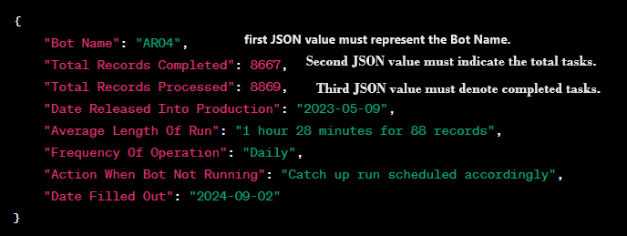
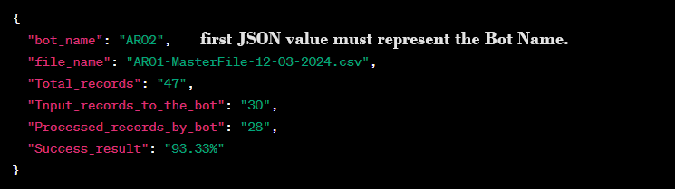
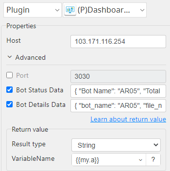

# Dashboard Api

***Dashboard Api with this plug-in can download file from url.***

## Dashboard Api
| Item         |           Value            |
|--------------|:--------------------------:|
| Icon         |  |
| Display Name |     **Dashboard Api**      |

### Arun Kumar (arunk@argos-labs.com)

Arun Kumar
* [Email](mailto:arunk@argos-labs.com) 
 
## Version Control 
* [6.0413.0833](setup.yaml)
* Release Date: `April 13, 2024`

## Input (Required)
| Display Name     | Parameters                               | Output    |
|------------------|------------------------------------------|-----------|
| Host             | Server IP                                | str(data) |
| Port             | Port                                     |           |
| Bot Status Data  | Json data to create or update Bot status |           |
| Bot Details Data | Json data to add Bot Details             |           |                              | str(data) |

## Note :-
* The JSON keys for Bot Status and Bot Details data are independent.
* Max 20 column can be inserted for Bot Status and Bot Details data.

**Bot Status Data**
* The first JSON value must represent the Bot Name.
* The second JSON value must indicate the total tasks.
* The third JSON value must denote completed tasks.

 

**Bot Details Data**
* The first JSON value must specify the Bot Name.

## Return Value

### Normal Case
Description of the output result

## Return Code
| Code | Meaning                      |
|------|------------------------------|
| 0    | Success                      |
| 1    | Exceptional case             |

## Output Format
You may choose one of 3 output formats below,

<ul>
  <li>String (default)</li>
  <li>CSV</li>
  <li>File</li>
</ul>  

## Parameter setting (diagrams)

## Operations

### Dashboard API:

